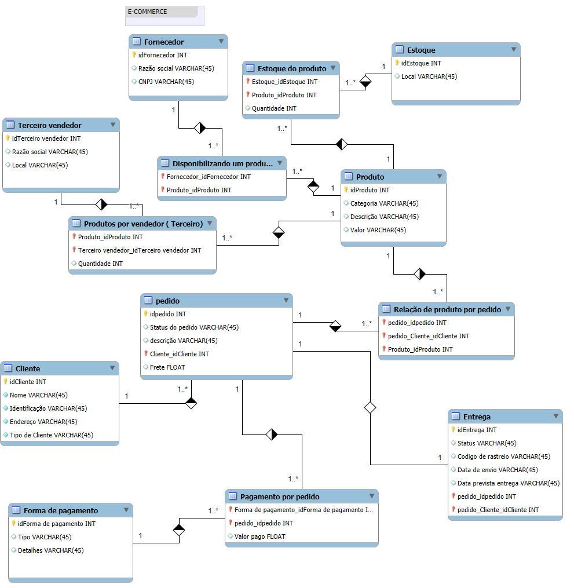

# Modelo Conceitual de Banco de Dados para E-commerce

Este modelo conceitual foi desenvolvido para gerenciar as principais operações de um sistema de e-commerce. Ele inclui tabelas que representam clientes, produtos, fornecedores, pedidos, entregas e formas de pagamento, além de outras entidades que suportam essas operações. Abaixo está a descrição de cada tabela e dos relacionamentos.

---

### Tabelas

1. **Cliente**
   - **Campos**:
     - `idCliente` (PK): Identificador único do cliente.
     - `Nome`: Nome do cliente.
     - `Identificação`: CPF ou CNPJ do cliente.
     - `Endereço`: Endereço de entrega do cliente.
     - `Tipo de Cliente`: Identifica se o cliente é pessoa física ou jurídica.
   - **Descrição**: Armazena informações sobre o cliente, diferenciando se é pessoa física ou jurídica.

2. **Fornecedor**
   - **Campos**:
     - `idFornecedor` (PK): Identificador único do fornecedor.
     - `Razão Social`: Nome da empresa fornecedora.
     - `CNPJ`: Número de identificação fiscal do fornecedor.
   - **Descrição**: Contém os dados dos fornecedores que fornecem produtos ao sistema.

3. **Estoque**
   - **Campos**:
     - `idEstoque` (PK): Identificador único do local de armazenamento.
     - `Local`: Descrição do local onde o estoque está armazenado.
   - **Descrição**: Representa os locais físicos onde os produtos são armazenados.

4. **Estoque do Produto**
   - **Campos**:
     - `Estoque_idEstoque` (FK): Identificador do estoque.
     - `Produto_idProduto` (FK): Identificador do produto.
     - `Quantidade`: Quantidade disponível no estoque.
   - **Descrição**: Relaciona os produtos com seus respectivos estoques e quantidades.

5. **Produto**
   - **Campos**:
     - `idProduto` (PK): Identificador único do produto.
     - `Categoria`: Categoria à qual o produto pertence.
     - `Descrição`: Breve descrição do produto.
     - `Valor`: Preço do produto.
   - **Descrição**: Contém informações sobre os produtos disponíveis no sistema.

6. **Terceiro Vendedor**
   - **Campos**:
     - `idTerceiroVendedor` (PK): Identificador único do vendedor externo.
     - `Razão Social`: Nome do vendedor.
     - `Local`: Local de operação do vendedor.
   - **Descrição**: Representa vendedores terceirizados que disponibilizam produtos na plataforma.

7. **Disponibilizando um Produto**
   - **Campos**:
     - `Fornecedor_idFornecedor` (FK): Relaciona o fornecedor ao produto disponibilizado.
     - `Produto_idProduto` (FK): Identificador do produto fornecido.
   - **Descrição**: Tabela associativa que conecta fornecedores aos produtos que fornecem.

8. **Produtos por Vendedor (Terceiro)**
   - **Campos**:
     - `Produto_idProduto` (FK): Identificador do produto.
     - `TerceiroVendedor_idTerceiroVendedor` (FK): Identificador do vendedor.
     - `Quantidade`: Quantidade de produtos oferecida pelo terceiro.
   - **Descrição**: Tabela que mapeia produtos vendidos por terceiros e suas quantidades.

9. **Pedido**
   - **Campos**:
     - `idpedido` (PK): Identificador único do pedido.
     - `Status do pedido`: Status atual do pedido (e.g., "Processando", "Enviado").
     - `descrição`: Descrição adicional do pedido.
     - `Cliente_idcliente` (FK): Referência ao cliente que fez o pedido.
     - `Frete`: Valor do frete associado ao pedido.
   - **Descrição**: Contém informações gerais sobre os pedidos feitos pelos clientes.

10. **Relação de Produto por Pedido**
    - **Campos**:
      - `pedido_idpedido` (FK): Referência ao pedido.
      - `pedido_Cliente_idCliente` (FK): Referência ao cliente.
      - `Produto_idProduto` (FK): Referência ao produto incluído no pedido.
    - **Descrição**: Mapeia os produtos dentro de cada pedido, permitindo que um pedido inclua vários produtos.

11. **Forma de Pagamento**
    - **Campos**:
      - `idFormaPagamento` (PK): Identificador único da forma de pagamento.
      - `Tipo`: Tipo de pagamento (e.g., "Cartão de Crédito", "Boleto").
      - `Detalhes`: Informações adicionais sobre a forma de pagamento.
    - **Descrição**: Representa as diferentes formas de pagamento disponíveis.

12. **Pagamento por Pedido**
    - **Campos**:
      - `Forma_de_pagamento_idFormaPagamento` (FK): Referência à forma de pagamento utilizada.
      - `pedido_idpedido` (FK): Referência ao pedido pago.
      - `Valor pago`: Quantia paga para o pedido em uma transação específica.
    - **Descrição**: Relaciona as formas de pagamento com os pedidos, permitindo pagamentos parciais.

13. **Entrega**
    - **Campos**:
      - `idEntrega` (PK): Identificador único da entrega.
      - `StatusEntrega`: Status da entrega (e.g., "Pendente", "Em Transporte").
      - `CodigoRastreio`: Código de rastreamento fornecido pela transportadora.
      - `DataEnvio`: Data em que a encomenda foi enviada.
      - `DataEntregaPrevista`: Data estimada de entrega.
      - `pedido_idpedido` (FK): Referência ao pedido associado.
      - `pedido_Cliente_idCliente` (FK): Referência ao cliente associado.
    - **Descrição**: Contém informações detalhadas sobre o status e rastreamento da entrega para cada pedido.

---

### Relacionamentos

- **Cliente - Pedido**: Um cliente pode ter múltiplos pedidos (1:N).
- **Pedido - Relação de Produto por Pedido**: Um pedido pode incluir múltiplos produtos, e cada produto pode estar em múltiplos pedidos (N:M).
- **Pedido - Forma de Pagamento**: Um pedido pode ser pago por uma ou mais formas de pagamento (1:N).
- **Pedido - Entrega**: Um pedido pode ter uma ou mais entregas associadas (1:N), cada uma com status e código de rastreamento.
- **Produto - Estoque do Produto**: Um produto pode estar em múltiplos estoques, e cada estoque pode conter múltiplos produtos (N:M).
- **Fornecedor - Disponibilizando um Produto**: Um fornecedor pode disponibilizar múltiplos produtos, e cada produto pode ser disponibilizado por múltiplos fornecedores (N:M).
- **Terceiro Vendedor - Produtos por Vendedor (Terceiro)**: Um terceiro pode vender múltiplos produtos, e cada produto pode ser vendido por múltiplos terceiros (N:M).

---

Esse detalhamento ajuda a entender o propósito de cada tabela e os relacionamentos envolvidos no modelo de dados do e-commerce.

## Imagem do Modelo

Veja abaixo o diagrama do modelo conceitual:

